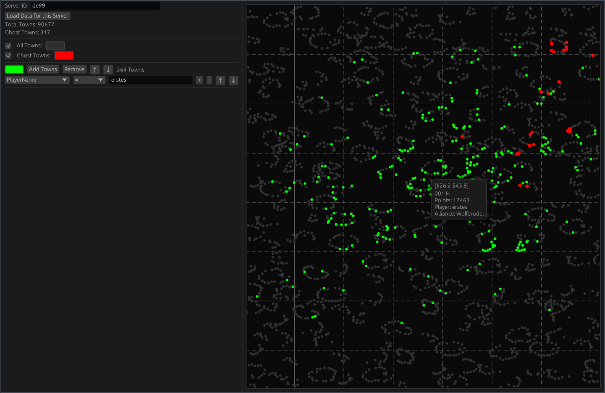

# Install

Go to the [releases page](https://github.com/Turun/GrepolisMap/releases) and download the binary for your system. It's a standalone executable of only a few MB.

# Features

- Load data from Grepolis servers and show it as a zoomable map

- Show ghosttowns

- Highlight towns via arbitrary constraints, e.g. all towns that are in a specific alliance, or all towns that belong to user xyz

- Highlight only towns that fulfill multiple constraints, e.g. all towns that do not belong to your alliance and do not belong to your sister alliance and where the player has less than 100k Points

- Import and export these collections of Constraints (Selections) to share with your allies or to keep differently filtered maps on hand.

- Automatically saves the data from Grepolis and enables you to look back in time.

- Dark mode and light mode

# Usage

The sidebar shows a list of town selections, which are all towns on the selected server that comply with the constraints for that selection. You can add selections by pressing the `+` button. Reordering the selections is useful if a town is part of multiple selections, the last one in the list will determine the color with which the town is painted.

Selections can contain many constraints. A default one (PlayerName with empty input) is provided. More can be added by pressing the `+` button. You can restrict any property shown in the combobox menu, for example player name, alliance name, player points, town location, etc and filter by equals, greater than, less than, or not equals.

# Roadmap

Stuff that I want to implement at some point:

- Autodelete saved databases after a configurable amount of time (One Day, One Week, One Month). Maybe also give the option to never save any database locally? 

- Temporal comparison. A special mode to show the differences between two database states in addition to other constraints like we already have.

- Export of the map in a better format for sharing. Can do this using App::post_rendering and Frame::Screenshot. Maybe.
