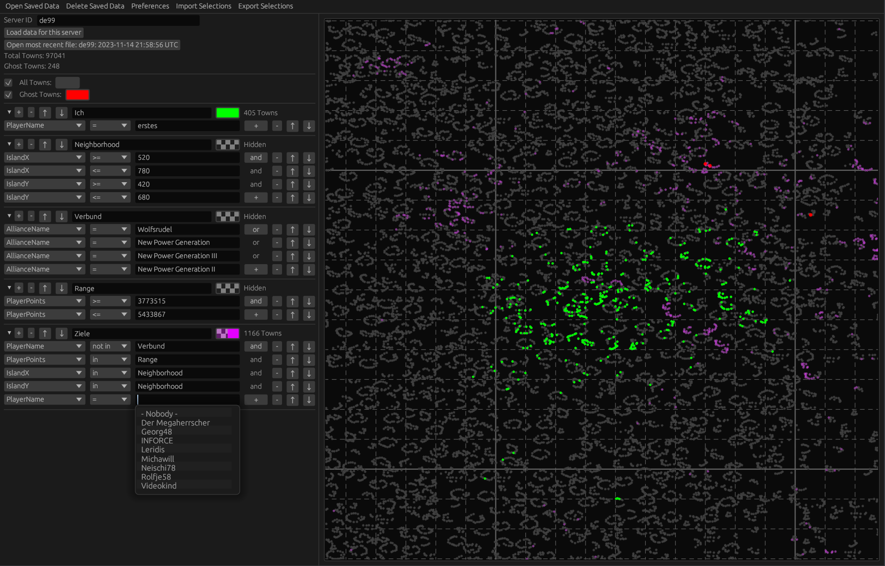

# Install

Go to the [releases page](https://github.com/Turun/GrepolisMap/releases) and download the binary for your system. It's a standalone executable of only a few MB.

# Usage

The sidebar shows a list of town selections, which are all towns on the selected server that comply with the constraints for that selection. You can add selections by pressing the `Add Towns` button. Reordering the selections is useful if a town is part of multiple selections, the last one in the list will determine the color with which the town is painted.

Selections can contain many constraints. A default one (PlayerName with empty input) is provided. More can be added by pressing the `+` button. You can restrict any property shown in the combobox menu, for example player name, alliance name, player points, town location, etc and filter by equals, greater than, less than, or not equals. In order for a town to be in a selection it must match _all_ provided filters. 

